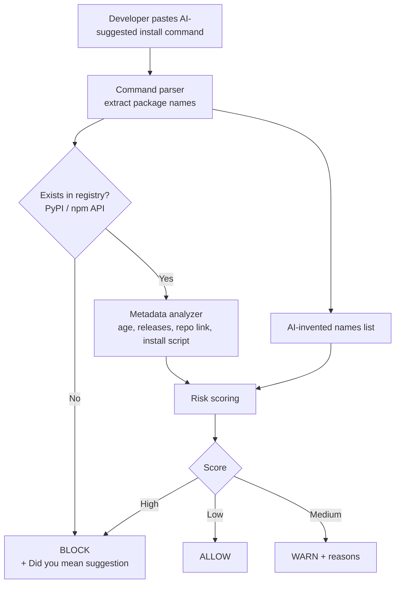

# Slopsquatting Shield

A safety check that verifies software packages suggested by AI coding assistants **before** a developer installs them.

**Logic League Ideathon | Theme: Cybersecurity (Software Supply Chain, Security for Developers)**

---

## 1. Problem Statement

**What is the problem?**
AI coding assistants sometimes suggest software packages that do not exist. They invent names that sound real, such as `pdf-reader-pro`. This creates an attack called **slopsquatting** (slop = made-up AI output, squatting = grabbing a name before its owner). An attacker registers the invented name on a public registry such as PyPI or npm and hides malware inside. When a developer copies the AI's `pip install` or `npm install` command, the malicious package is installed.

**Who experiences it?**
Anyone who installs dependencies from AI suggestions: students, beginners, freelancers, and professional developers. Beginners are the most exposed because they copy and run commands without checking them.

**Why is it a problem?**
- AI models tend to repeat the same invented names, so attackers can predict which names to register.
- The developer makes no mistake, such as a typo. They follow the AI's advice exactly, so typo-based defenses do not catch it.
- Packages can run code automatically at install time, so the damage can happen before anyone reviews anything.

**What difficulties or inefficiencies does it create?**
- Stolen passwords, API keys and cloud credentials, and malware on developer machines.
- Malicious code can reach company servers, build pipelines and end users.
- Checking every suggested package by hand is slow and inconsistent, so it is usually skipped.

---

## 2. Existing Solutions

| Existing solution | What it does | Limitation for this problem |
|---|---|---|
| `npm audit`, `pip-audit`, Dependabot | Report known vulnerabilities in existing packages | A newly registered malicious package has no known vulnerability yet, so nothing is reported |
| Software composition analysis (SCA) scanners | Analyse package risk and behaviour | Often run at pull-request or CI time, after the dependency has already been added, and do not treat "an AI may have invented this name" as a signal |
| Typosquatting detectors | Compare package names with popular names | AI-invented names are usually not a misspelling of any real package |
| Lockfiles and version pinning | Make installs reproducible | They lock in whatever was installed first, including a malicious package |
| Manual checking | Developer reads the package page | Slow, inconsistent, and rarely done by beginners |

**Gap:** no common tool checks a package name at the moment between the AI's suggestion and the install command.

---

## 3. Proposed Solution

Slopsquatting Shield sits between the AI's suggestion and the install. The developer pastes the install command (or the tool intercepts it), and the Shield checks every package in it against the official registry **before** anything is installed.

For each package it returns one of three verdicts, with plain-English reasons:

- **BLOCK**: the package does not exist, or is highly risky. Do not install.
- **WARN**: the package exists but looks suspicious (very new, no source repository, almost no history).
- **ALLOW**: the package is old, established and linked to a public source repository.

A package that does not exist is the strongest sign that an AI invented the name, and the tool suggests the real package the AI most likely meant (for example `pdf-reader-pro` → `pypdf`). This stops the attack at the earliest point and teaches developers why a package is risky.


---

## 4. Key Features

- **Pre-install command check**: reads `pip`, `npm`, `yarn` and `pnpm` install commands and checks each package name, ignoring versions and flags.
- **Existence check**: confirms the package actually exists in the official registry. A missing package is blocked immediately as a likely AI invention.
- **Registry risk score**: scores packages using their age, number of releases, source-repository link and install-time scripts.
- **AI-invented names list**: a list of package names AI models commonly make up. A match raises the risk score.
- **"Did you mean" suggestion**: points the developer to the real package they probably wanted.
- **Explainable verdicts**: every BLOCK, WARN or ALLOW comes with the reasons behind it.

---

## 5. Technical Approach

### System architecture



### Major components

1. **Command parser**: extracts package names from `pip`, `npm`, `yarn` and `pnpm` commands, handling versions, extras, scoped packages and flags.
2. **Registry client**: looks up each package in the PyPI and npm registries.
3. **Metadata analyzer**: reads first-publish date, release count, linked source repository and install-time scripts.
4. **AI-invented names list**: a list of names AI models commonly invent, each optionally mapped to the real package.
5. **Risk scoring engine**: combines the signals into a score and a verdict.
6. **Explanation and suggestion module**: turns the triggered signals into plain-English reasons and finds a "did you mean" package.

### Data flow

Install command → package names → registry lookup → (not found: BLOCK) or metadata + names-list match → risk score → verdict, reasons and suggestion shown to the developer.

### Algorithms and methodology

A transparent, rule-based score (no black-box model), so every point can be explained to the user:

| Signal | Points |
|---|---|
| Package does not exist | BLOCK immediately |
| Name is on the AI-invented list | +40 |
| First published under 30 days ago | +25 |
| First published 30 to 180 days ago | +10 |
| No linked source repository | +15 |
| Only 1 to 2 releases | +10 |
| Runs a script at install time (npm) | +10 |
| 1+ year old with 10+ releases | −30 |

Score 60 or more = **BLOCK**, 25 or more = **WARN**, otherwise **ALLOW**. "Did you mean" uses the names list first, then string similarity against popular packages.

The AI-invented names list is built by asking several AI assistants common coding questions, collecting every package they suggest, and keeping the names that do not exist in the registry. The prototype uses a list collected this way by hand; automating the collection is planned.

### APIs and external services

- PyPI JSON API (`https://pypi.org/pypi/<package>/json`)
- npm registry API (`https://registry.npmjs.org/<package>`)

Both are free and public. No API keys are needed.

### Infrastructure requirements

Minimal. The prototype runs locally with Python and an internet connection. A hosted version would need one small web service and a small database.

### Security considerations

- The tool **never installs or executes** a package. It only reads public registry metadata.
- User input is only parsed as text and is never passed to a shell.
- Only package names are sent to the registries. No source code or private data leaves the machine.
- Requests use HTTPS with timeouts. If a registry cannot be reached, the tool reports "unknown" instead of guessing "safe".
- Limitation: it judges metadata, not the package's code, so a well-aged malicious package could still pass.

---

## 6. Technology Stack

```text
Language / Core logic:   Python 3
Frontend (prototype):    Streamlit web interface
Registry access:         Requests library, PyPI JSON API, npm registry API
Data store (prototype):  JSON file for the AI-invented names list
Parsing and matching:    Python standard library (re, shlex, difflib)

Planned
Editor integration:      VS Code extension (TypeScript)
Backend service:         FastAPI
Database:                PostgreSQL with a cache
CI integration:          GitHub Actions
```

---

## 7. Expected Impact

**Who benefits?**
Students and beginner developers who copy AI commands, professional developers and teams who use AI assistants, and organisations whose build systems could be compromised through one bad dependency.

**How does it improve the current situation?**
Today, an AI-suggested package is installed with no check at all. With the Shield, every suggested package is checked first, risky ones are stopped before any code runs, and the developer learns why through plain-English reasons.

**What could be achieved if successfully implemented?**
- Slopsquatting attacks stopped before they execute.
- Safer use of AI coding tools, especially by beginners.
- A shared, growing list of AI-invented package names that other tools and registries could use.

---

## 8. Future Scope

- **Additional features:** automate collection of AI-invented names; detect invented functions and API methods, not only package names.
- **Larger-scale deployment:** a shared hosted service and database so teams and organisations use one common names list.
- **More users and use cases:** support more ecosystems (Cargo, Go modules, Maven, RubyGems, Docker images) and a browser extension that checks commands inside AI chat pages.
- **Integration with other systems:** a VS Code extension that checks automatically as code is written, a GitHub Action that checks dependencies in pull requests, and partnership with registries to flag or reserve frequently invented names.
- **Technical improvements:** tune the scoring weights using labelled examples, and add checks on package contents in addition to metadata.

---

## Repository Contents

```text
README.md        Submission document (this file)
presentation/    Slide deck (PowerPoint)
prototype/       Working prototype (Python)
docs/            Screenshot used in this README
```

**Run the prototype** (Python 3 and an internet connection required):

```bash
cd prototype
pip install -r requirements.txt
python -m streamlit run app.py
```

Or from the command line: `python shield.py "pip install requests some-package"`
